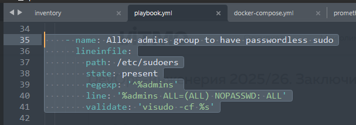
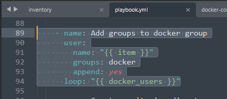
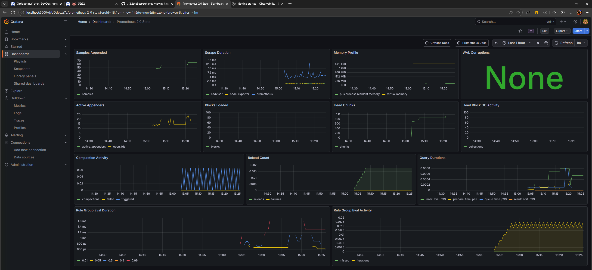
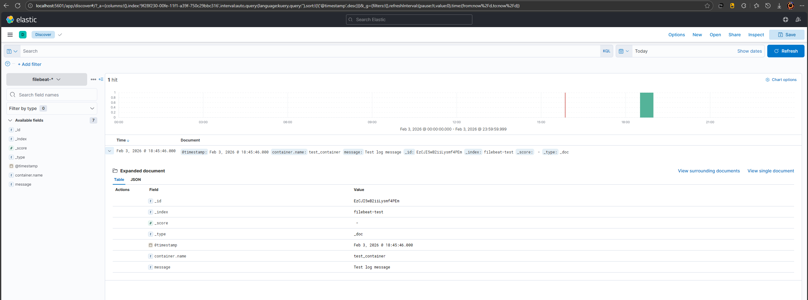
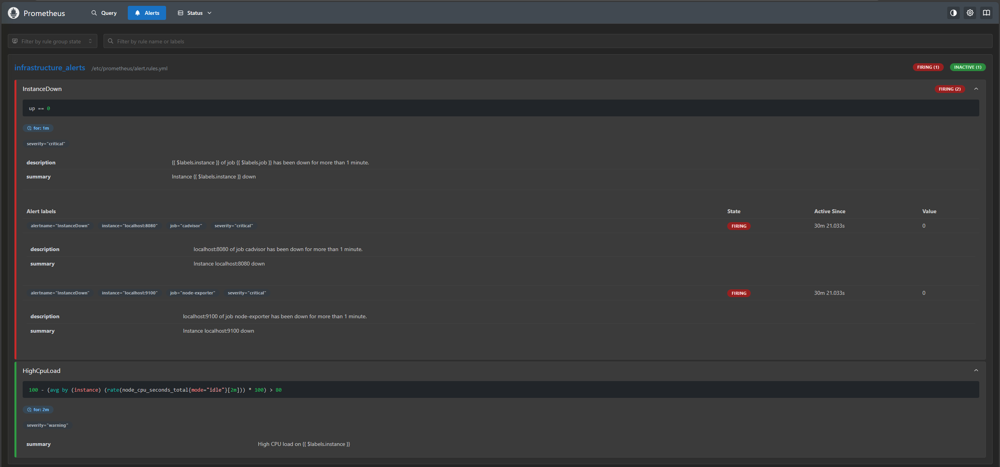
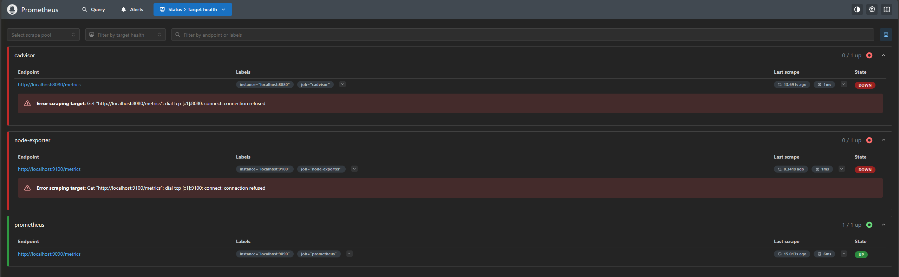

# suhangulyyev.m-itmo-megaschool-devops-2026

Решение задач по автоматизации развертывания инфраструктуры с использованием Ansible и Docker.

## Стек технологий

* Ansible
* Docker, Docker Compose
* Prometheus, Grafana, cAdvisor, Note Exporter
* Elasticsearch, Kibana, Filebeat

## Local (Docker)

0. Подготовка сервера:
	```bash
	ansible-playbook -i inventory playbook.yml
	```
1. Запустить Docker Desktop.
2. Перейти в папку `monitoring`:
	```bash
	cd monitoring
	```
3. Запустить все сервисы:
	```bash
	docker compose up -d
	```

## Точки доступа к сервисам

* Grafana: http://localhost:3000 (login: `admin`, password: `admin`)
* Prometheus: http://localhost:9090
* Kibana: http://localhost:5601
* Alertmanager: http://localhost:9093

**Настройка sudo без пароля для группы admins:**


**Добавление пользователей в группу docker:**


**Скриншот дашборда Grafana:**


**Скриншот логов Kibana:**


**Скриншот алертов в Prometheus:**



**20 сктрок логов работы контейнера логирования в файле:**
[filebeat.log](https://github.com/JKL2theBest/suhangulyyev.m-itmo-megaschool-devops-2026/tree/main/docs/filebeat.log)

**JSON-файл дашборда Grafana:**
[Grafana Dashboard JSON](https://github.com/JKL2theBest/suhangulyyev.m-itmo-megaschool-devops-2026/tree/main/docs/Grafana_dashboard.json)
